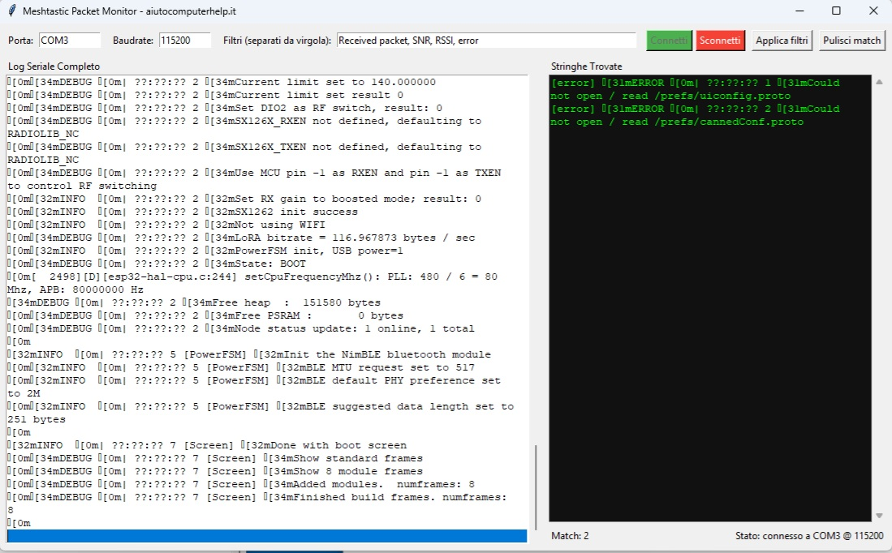

# Meshtastic Packet Monitor 

Un monitor seriale progettato specificamente per dispositivi **Meshtastic**. Visualizza e filtra i pacchetti in tempo reale con evidenziazione delle parole chiave e conteggio dei match.

##  Caratteristiche

-  **Connessione manuale** - Connetti/sconnetti quando vuoi senza reset automatico
-  **Doppia visualizzazione** - Log completo a sinistra, match filtrati a destra
-  **Filtri personalizzabili** - Monitora solo le parole chiave che ti interessano
-  **Alert sonori** - Beep ad ogni nuovo match trovato
-  **Conteggio match** - Contatore in tempo reale delle occorrenze
-  **Evidenziazione** - Righe con match evidenziate in rosso nel log principale
-  **Multi-threading** - Interfaccia sempre reattiva

##  Requisiti di Sistema

- Python 3.6 o superiore
- Porta seriale USB/COM disponibile

# Crea ambiente virtuale - consigliato
python -m venv venv

**Su windows**
venv\Scripts\activate

**Su Linux/Mac:**
source venv/bin/activate

# Installa 
pip install pyserial

# Lancia
python meshtastic_monitor.py
